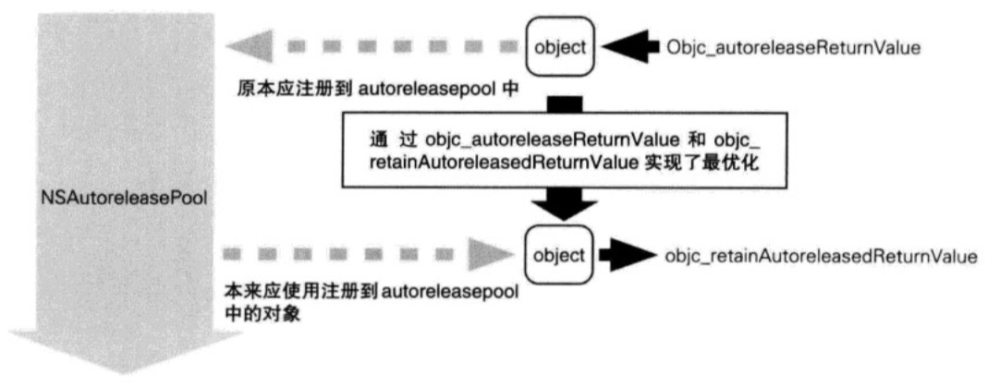

# 理解 ARC 实现原理

## 前言

ARC 是 iOS 中管理引用计数的技术，帮助 iOS 实现垃圾自动回收，具体实现的原理是由编译器进行管理的，同时运行时库协助编译器辅助完成。主要涉及到 Clang （LLVM 编译器） 和 objc4 运行时库。


本文主要内容由修饰符 \_\_strong 、 \_\_weak 、 \_\_autorelease 拓展开，分别延伸出引用计数、弱引用表、自动释放池等实现原理。在阅读本文之前，你可以看看下面几个问题：

* **在 ARC 下如何存储引用计数？**

* **如``[NSDictionary dictionary]``方法创建的对象在 ARC 中有什么不同之处。**

* **弱引用表的数据结构。**

* **解释一下自动释放池中的 Hot Page 和 Cold Page。**

如果上述几个问题你已经非常清楚，那本文可能对你的帮助有限，但如果你对这几个问题还存有疑问，那相信本文一定能解答你的疑问。


## 一、Clang

在 Objective-C 中，对象的引用关系由引用修饰符来决定，如``__strong ``、``__weak``、``__autorelease``等等，编译器会根据不同的修饰符生成不同逻辑的代码来管理内存。


首先看看 Clang 在其中具体起到哪些作用，我们可以在命令行使用下面的命令来将 Objective-C 代码转成 LLVM 中间码：

```
// 切换到你文件路径下
cd Path
// 利用 main.m 生成中间码文件 main.ll
clang -S -fobjc-arc -emit-llvm main.m -o main.ll 
```

我在``main.m``文件中加入``defaultFunction ``方法，然后利用的命令行命令将其转换成中间码：

```
void defaultFunction() {
    id obj = [NSObject new];
}
```

在命令行输入命令后你可以在文件夹下面发现``main.ll ``，它的内容如下：

```
define void @defaultFunction() #0 {
  %1 = alloca i8*, align 8
  %2 = load %struct._class_t*, %struct._class_t** @"OBJC_CLASSLIST_REFERENCES_$_", align 8
  %3 = load i8*, i8** @OBJC_SELECTOR_REFERENCES_, align 8, !invariant.load !8
  %4 = bitcast %struct._class_t* %2 to i8*
  %5 = call i8* bitcast (i8* (i8*, i8*, ...)* @objc_msgSend to i8* (i8*, i8*)*)(i8* %4, i8* %3)
  %6 = bitcast i8* %5 to %0*
  %7 = bitcast %0* %6 to i8*
  store i8* %7, i8** %1, align 8
  call void @objc_storeStrong(i8** %1, i8* null) #4
  ret void
}
```

虽然内容有点多，但是仔细分析下来大概就是以下内容：

```
void defaultFunction() {
	id obj = obj_msgSend(NSObject, @selector(new));
	objc_storeStrong(obj, null);
}
```

``obj_msgSend(NSObject, @selector(new))``非常好理解，就是新建一个对象，而``objc_storeStrong ``是 objc4 库中的方法，具体逻辑如下：

```
void objc_storeStrong(id *location, id obj)
{
    id prev = *location;
    if (obj == prev) {
        return;
    }
    objc_retain(obj);
    *location = obj;
    objc_release(prev);
}
```

上面的代码按顺序做了以下 4 件事：

1. 检查输入的 obj 地址 和指针指向的地址是否相同。
2. 持有对象，引用计数 + 1 。
3. 指针指向 obj。
4. 原来指向的对象引用计数 - 1。

其中``objc_retain``和``objc_release ``也是 objc4 库中的方法，在本文后面分析 objc4 库的章节会详细讲。

## 二、 isa

在分析 ARC 相关源码之前，需要对 isa 有一定了解，其中存储了一些非常重要的信息，下面是 isa 的结构组成：

```
union isa_t 
{
    Class cls;
    uintptr_t bits;
    struct {
         uintptr_t nonpointer        : 1;//->表示使用优化的isa指针
         uintptr_t has_assoc         : 1;//->是否包含关联对象
         uintptr_t has_cxx_dtor      : 1;//->是否设置了析构函数，如果没有，释放对象更快
         uintptr_t shiftcls          : 33; // MACH_VM_MAX_ADDRESS 0x1000000000 ->类的指针
         uintptr_t magic             : 6;//->固定值,用于判断是否完成初始化
         uintptr_t weakly_referenced : 1;//->对象是否被弱引用
         uintptr_t deallocating      : 1;//->对象是否正在销毁
         uintptr_t has_sidetable_rc  : 1;//1->在extra_rc存储引用计数将要溢出的时候,借助Sidetable(散列表)存储引用计数,has_sidetable_rc设置成1
        uintptr_t extra_rc          : 19;  //->存储引用计数
    };
};
```

其中``nonpointer``、``weakly_referenced``、``has_sidetable_rc``和``extra_rc``都是 ARC 有直接关系的成员变量，其他的大多也有涉及到。


```
struct objc_object {
    isa_t isa;
};
```

从下面代码可以知道，``objc_object``就是 isa 基础上一层封装。


```
struct objc_class : objc_object {
    isa_t isa;
    Class superclass;
    cache_t cache; 方法实现缓存和 vtable
    class_data_bits_t bits; // class_rw_t * plus custom rr/alloc flags
};
```

``objc_class``继承了``objc_object``，结构如下：

* ``isa``：objc\_object 指向类，objc\_class 指向元类。
* ``superclass``：指向父类。
* ``cache``：存储用户消息转发优化的方法缓存和 vtable 。
* ``bits``：class\_rw\_t 和 class\_ro\_t ，保存了方法、协议、属性等列表和一些标志位。


## 三、 __strong 修饰符

在 MRC 时代 Retain 修饰符将会使被引用的对象引用计数 + 1 ，在 ARC 中 __strong 修饰符作为其替代者，具体起到什么样的作用？我们可以通过 Clang 将 Objective-C 代码转成 LLVM 来分析其中原理。

### 3.1 __strong 修饰符的中间码

接下来继续将 Objective-C 代码转成 LLVM 中间码，这次我们试一下``__strong``修饰符：

```
void strongFunction() {
    id obj = [NSObject new];
    __strong id obj1 = obj;
}
```

中间码(后面的中间码为了方便理解就删除无用代码)：

```
void defaultFunction() {
	id obj = obj_msgSend(NSObject, @selector(new));
	id obj1 = objc_retain(obj)
	objc_storeStrong(obj, null);
	objc_storeStrong(obj1, null);
}
```

上面代码一看就是非常常规的操作，创建对象、引用计数 + 1 、 分别释放，将``objc_storeStrong``里面的逻辑嵌入可得：

```
void defaultFunction() {
	id obj = obj_msgSend(NSObject, @selector(new));
	id obj1 = objc_retain(obj)
	objc_release(obj);
	objc_release(obj1);
}
```

### 3.2 objc\_retain

接下来我们通过分析 objc4 库的源码来了解``objc_retain``和``objc_release``的内部逻辑。先看``objc_retain``具体实现：

```
id objc_retain(id obj) {
    if (!obj) return obj;
    if (obj->isTaggedPointer()) return obj;
    return obj->retain();
}
```

继续往下查看最终定位到``objc_object::rootRetain ``方法：

```
ALWAYS_INLINE id objc_object::rootRetain(bool tryRetain, bool handleOverflow) {
    // 如果是 TaggedPointer 直接返回
    if (isTaggedPointer()) return (id)this;

    bool sideTableLocked = false;
    bool transcribeToSideTable = false;

    isa_t oldisa;
    isa_t newisa;

    do {
        transcribeToSideTable = false;
        // 获取 isa
        oldisa = LoadExclusive(&isa.bits);
        newisa = oldisa;
        if (slowpath(!newisa.nonpointer)) {
            // 未优化的 isa 部分
            ClearExclusive(&isa.bits);
            if (!tryRetain && sideTableLocked) sidetable_unlock();
            // 
            if (tryRetain) return sidetable_tryRetain() ? (id)this : nil;
            else return sidetable_retain();
        }
        // 正在被释放的处理
        // don't check newisa.fast_rr; we already called any RR overrides
        if (slowpath(tryRetain && newisa.deallocating)) {
            ClearExclusive(&isa.bits);
            if (!tryRetain && sideTableLocked) sidetable_unlock();
            return nil;
        }
        // extra_rc 未溢出时引用计数++
        uintptr_t carry;
        newisa.bits = addc(newisa.bits, RC_ONE, 0, &carry);  // extra_rc++

        // extra_rc 溢出
        if (slowpath(carry)) {
            // newisa.extra_rc++ overflowed
            if (!handleOverflow) {
                ClearExclusive(&isa.bits);
                // 重新调用该函数 入参 handleOverflow 为 true
                return rootRetain_overflow(tryRetain);
            }
            // 保留一半引用计数
            // 准备将另一半复制到 side table.
            if (!tryRetain && !sideTableLocked) sidetable_lock();
            sideTableLocked = true;
            transcribeToSideTable = true;
            newisa.extra_rc = RC_HALF;
            newisa.has_sidetable_rc = true;
        }
        //  更新 isa 值
    } while (slowpath(!StoreExclusive(&isa.bits, oldisa.bits, newisa.bits)));

    if (slowpath(transcribeToSideTable)) {
        // 将另一半复制到 side table side table.
        sidetable_addExtraRC_nolock(RC_HALF);
    }

    if (slowpath(!tryRetain && sideTableLocked)) sidetable_unlock();
    return (id)this;
}
```

上面的代码分成 3 个小分支：

* TaggedPointer：值存在指针内，直接返回。
* !newisa.nonpointer：未优化的 isa ，使用``sidetable_retain()``。
* newisa.nonpointer：已优化的 isa ， 这其中又分 extra_rc 溢出和未溢出的两种情况。
	* 未溢出时，``isa.extra_rc`` + 1 完事。
	* 溢出时，将 ``isa.extra_rc`` 中一半值转移至``sidetable``中，然后将``isa.has_sidetable_rc``设置为``true``，表示使用了``sidetable``来计算引用次数。


### 3.3 objc\_release

继续看``objc_release``具体实现，最终定位到``objc_object::rootRelease``方法：

```
ALWAYS_INLINE bool objc_object::rootRelease(bool performDealloc, bool handleUnderflow)
{
    if (isTaggedPointer()) return false;

    bool sideTableLocked = false;

    isa_t oldisa;
    isa_t newisa;

 retry:
    do {
        oldisa = LoadExclusive(&isa.bits);
        newisa = oldisa;
        if (slowpath(!newisa.nonpointer)) {
            // 未优化 isa
            ClearExclusive(&isa.bits);
            if (sideTableLocked) sidetable_unlock();
            // 入参是否要执行 Dealloc 函数，如果为 true 则执行 SEL_dealloc
            return sidetable_release(performDealloc);
        }

        // extra_rc --
        newisa.bits = subc(newisa.bits, RC_ONE, 0, &carry);  // extra_rc--
        if (slowpath(carry)) {
            // don't ClearExclusive()
            goto underflow;
        }
        // 更新 isa 值
    } while (slowpath(!StoreReleaseExclusive(&isa.bits, 
                                             oldisa.bits, newisa.bits)));

    if (slowpath(sideTableLocked)) sidetable_unlock();
    return false;

 underflow:
 	// 处理下溢，从 side table 中借位或者释放

    newisa = oldisa;
    // 如果使用了 sidetable_rc
    if (slowpath(newisa.has_sidetable_rc)) {
        if (!handleUnderflow) {
        	// 调用本函数处理下溢
            ClearExclusive(&isa.bits);
            return rootRelease_underflow(performDealloc);
        }

        // 从 sidetable 中借位引用计数给 extra_rc
        size_t borrowed = sidetable_subExtraRC_nolock(RC_HALF);

        if (borrowed > 0) {
			// extra_rc 是计算额外的引用计数，0 即表示被引用一次
            newisa.extra_rc = borrowed - 1;  // redo the original decrement too
            bool stored = StoreReleaseExclusive(&isa.bits, 
                                                oldisa.bits, newisa.bits);
                                                
            // 保存失败，恢复现场，重试                                    
            if (!stored) {
                isa_t oldisa2 = LoadExclusive(&isa.bits);
                isa_t newisa2 = oldisa2;
                if (newisa2.nonpointer) {
                    uintptr_t overflow;
                    newisa2.bits = 
                        addc(newisa2.bits, RC_ONE * (borrowed-1), 0, &overflow);
                    if (!overflow) {
                        stored = StoreReleaseExclusive(&isa.bits, oldisa2.bits, 
                                                       newisa2.bits);
                    }
                }
            }

			// 如果还是保存失败，则还回 side table
            if (!stored) {
                sidetable_addExtraRC_nolock(borrowed);
                goto retry;
            }

            sidetable_unlock();
            return false;
        }
        else {
            // Side table is empty after all. Fall-through to the dealloc path.
        }
    }
    // 没有使用 sidetable_rc ，或者 sidetable_rc 计数 == 0 的就直接释放

    // 如果已经是释放中，抛个过度释放错误
    if (slowpath(newisa.deallocating)) {
        ClearExclusive(&isa.bits);
        if (sideTableLocked) sidetable_unlock();
        return overrelease_error();
        // does not actually return
    }
    // 更新 isa 状态
    newisa.deallocating = true;
    if (!StoreExclusive(&isa.bits, oldisa.bits, newisa.bits)) goto retry;

    if (slowpath(sideTableLocked)) sidetable_unlock();

	// 执行 SEL_dealloc 事件
    __sync_synchronize();
    if (performDealloc) {
        ((void(*)(objc_object *, SEL))objc_msgSend)(this, SEL_dealloc);
    }
    return true;
}
```

这么一长串代码，将其分解后和 rootRetain 逻辑类似：

* TaggedPointer： 直接返回 false。
* !nonpointer: 未优化的 isa 执行 sidetable_release。
* nonpointer：已优化的 isa ，分下溢和未下溢两种情况。
	* 未下溢： extra_rc--。
	* 下溢：从 sidetable 中借位给 extra_rc 达到半满，如果无法借位则说明引用计数归零需要进行释放。其中借位时可能保存失败会不断重试。

到这里可以知道 **引用计数分别保存在``isa.extra_rc``和``sidetable``中，当``isa.extra_rc``溢出时，将一半计数转移至``sidetable``中，而当其下溢时，又会将计数转回。当二者都为空时，会执行释放流程** 。

### 3.4 rootRetainCount

``objc_object::rootRetainCount ``方法是用来计算引用计数的。通过前面``rootRetain``和``rootRelease``的源码分析可以看出引用计数会分别存在``isa.extra_rc``和``sidetable``。中，这一点在``rootRetainCount``方法中也得到了体现。

```
inline uintptr_t objc_object::rootRetainCount()
{
	// TaggedPointer 直接返回
    if (isTaggedPointer()) return (uintptr_t)this;

    sidetable_lock();
    // 加载 isa
    isa_t bits = LoadExclusive(&isa.bits);
    ClearExclusive(&isa.bits);
    // 优化的 isa 需要 sidetable + bits.extra_rc + 1
    if (bits.nonpointer) {
        uintptr_t rc = 1 + bits.extra_rc;
        if (bits.has_sidetable_rc) {
            rc += sidetable_getExtraRC_nolock();
        }
        sidetable_unlock();
        return rc;
    }
	// 未优化返回 sidetable_retainCount
    sidetable_unlock();
    return sidetable_retainCount();
}
```

### 3.5 objc\_autoreleaseReturnValue 和 objc\_retainAutoreleasedReturnValue

在 MRC 时代有一句话叫 **谁创建谁释放** ，意思是由开发者通过``alloc``、``new``、``copy``和``mutableCopy``等方法创建的对象，需要开发者手动释放，而由其他方法创建并返回的对象返回给用户后也不需要开发者释放，比如说由``[NSMutableArray array]``方法创建的数组，这样的对象默认由自动释放池管理。进入 ARC 时代后，针对返回的对象编译器也做了一些特殊处理，具体通过下面的内容来理解其中奥妙。

首先将下方创建数组的代码转成中间码：

```
id strongArrayInitFunction() {
    return [[NSMutableArray alloc] init];
}

void strongArrayFunction() {
    __strong id obj = [NSMutableArray array];
}
```

中间码提炼后得到下面的代码：

```
strongArrayInitFunction() {
	id obj = objc_msgSend(objc_msgSend(NSMutableArray, @selector(alloc)), @selector(init));
	objc_autoreleaseReturnValue(obj);
	return obj;
}

strongArrayFunction() {
	id obj = objc_msgSend(NSMutableArray, @selector(array));
	objc_retainAutoreleasedReturnValue(obj)
	objc_release(obj);
}
```

相对于用户创建的对象，``[NSMutableArray array]``方法创建返回的对象转换后多出了一个``objc_retainAutoreleasedReturnValue``方法。这涉及到一个最优化处理：

1. 为了节省了一个将对象注册到``autoreleasePool``的操作，在执行``objc_autoreleaseReturnValue``时，根据查看后续调用的方法列表是否包含``objc_retainAutoreleasedReturnValue``方法，以此判断是否走优化流程。
2. 在执行``objc_autoreleaseReturnValue``时，优化流程将一个标志位存储在 TLS (Thread Local Storage) 中后直接返回对象。
3. 执行后续方法``objc_retainAutoreleasedReturnValue``时检查 TLS 的标志位判断是否处于优化流程，如果处于优化流程中则直接返回对象，并且将 TLS 的状态还原。




下面再通过源代码来进行分析，先看看``objc_autoreleaseReturnValue``具体实现：

```
id objc_autoreleaseReturnValue(id obj) {
	// 如果走优化程序则直接返回对象
    if (prepareOptimizedReturn(ReturnAtPlus1)) return obj;
	// 否则还是走自动释放池
    return objc_autorelease(obj);
}

static ALWAYS_INLINE bool prepareOptimizedReturn(ReturnDisposition disposition) {
    assert(getReturnDisposition() == ReturnAtPlus0);
	// 检查使用该函数的方法或调用方的的调用列表，如果紧接着执行 objc_retainAutoreleasedReturnValue ，将不注册到 autoreleasePool 中
    if (callerAcceptsOptimizedReturn(__builtin_return_address(0))) {
    	// 设置标记 ReturnAtPlus1
        if (disposition) setReturnDisposition(disposition);
        return true;
    }

    return false;
}

// 将 ReturnAtPlus1 或 ReturnAtPlus0 存入 TLS
static ALWAYS_INLINE void setReturnDisposition(ReturnDisposition disposition) {
    tls_set_direct(RETURN_DISPOSITION_KEY, (void*)(uintptr_t)disposition);
}

// 取出标记
static ALWAYS_INLINE ReturnDisposition getReturnDisposition() {
    return (ReturnDisposition)(uintptr_t)tls_get_direct(RETURN_DISPOSITION_KEY);
}
```

``objc_autoreleaseReturnValue``代码逻辑大概分为：

1. 检查调用者方法里后面是否紧跟着调用了``objc_retainAutoreleasedReturnValue ``。
2. 保存 ReturnAtPlus1 至 TLS 中。
3. 使用了优化处理则返回对象，否则加入自动释放池。

下面是``objc_retainAutoreleasedReturnValue``的源码分析：

```
id objc_retainAutoreleasedReturnValue(id obj) {
	// 如果 TLS 中标记表示使用了优化程序，则直接返回
    if (acceptOptimizedReturn() == ReturnAtPlus1) return obj;

    return objc_retain(obj);
}

static ALWAYS_INLINE ReturnDisposition acceptOptimizedReturn() {
	// 取出标记后返回
    ReturnDisposition disposition = getReturnDisposition();
    // 还原至未优化状态
    setReturnDisposition(ReturnAtPlus0);  // reset to the unoptimized state
    return disposition;
}
```

``objc_retainAutoreleasedReturnValue ``代码逻辑大概分为：

1. 取出 TLS 中标记。
2. 重置 TLS 中标记至 ReturnAtPlus0 。
3. 判断使用了优化处理则返回对象，否则引用计数 + 1。


通过分析源码可以得知下面这段代码的优化流程和未优化流程是有挺大的区别的：

```
strongArrayFunction() {
	id obj = objc_msgSend(NSMutableArray, @selector(array));
	objc_retainAutoreleasedReturnValue(obj)
	objc_release(obj);
}
```

最终优化流程相当于：

```
id obj = objc_msgSend(objc_msgSend(NSMutableArray, @selector(alloc)), @selector(init));
objc_release(obj);
```

而未优化流程相当于：

```
id obj = objc_msgSend(objc_msgSend(NSMutableArray, @selector(alloc)), @selector(init));
objc_autorelease(obj);
objc_retain(obj);
objc_release(obj);
```


## 四、__weak 修饰符

众所周知，weak 表示弱引用，引用计数不会增加。在原对象释放后，弱引用变量也会随之被清除，接下来一步步分析其中原理。

### 4.1 __weak 修饰符的中间码

首先将下面代码转换成中间码：

```
void weakFunction() {
    __weak id obj = [NSObject new];
}

void weak1Function() {
    id obj = [NSObject new];
    __weak id obj1 = obj;
}

void weak2Function() {
    id obj = [NSObject new];
    __weak id obj1 = obj;
    NSLog(@"%@",obj1);
}
```

下面是转化提炼后的中间码：

```
weakFunction() {
	id temp = objc_msgSend(NSObject, @selector(new));
	objc_initWeak(&obj, temp);
	objc_release(temp);
	objc_destroyWeak(obj);
}

weak1Function() {
	id obj = objc_msgSend(NSObject, @selector(new));
	objc_initWeak(&obj1, obj);
	objc_destroyWeak(obj1);
	objc_storeStrong(obj, null);
}

weak2Function() {
	id obj = objc_msgSend(NSObject, @selector(new));
	objc_initWeak(obj1, obj);
	id temp = objc_loadWeakRetained(obj1);
	NSLog(@"%@",temp);
	objc_release(temp);
	objc_destroyWeak(obj1);
	objc_storeStrong(obj, null);
}	
```

* weakFunction： 在该方法中声明 __weak 对象后并没有使用到，所以在``objc_initWeak``后，立即释放调用了``objc_release ``和``objc_destroyWeak``方法。

* weak1Function：该方法中``obj``是强引用，``obj1``是弱引用，``objc_initWeak``、 ``objc_destroyWeak``先后成对调用，对应着弱引用变量的初始化和释放方法。

* weak2Function：和``weak1Function``不同之处是使用了弱引用变量``obj1``，在使用弱引用变量之前，编译器创建了一个临时的强引用对象，在用完后立即释放。


### 4.2 objc\_initWeak 和 objc\_destroyWeak

#### 4.2.1 objc\_initWeak 和 objc\_destroyWeak

下面是``objc_initWeak``和``objc_destroyWeak``的代码实现：

```
id objc_initWeak(id *location, id newObj) {
    if (!newObj) {
        *location = nil;
        return nil;
    }
	// 该地址没有值，正赋予新值，如果正在释放将会 crash
    return storeWeak<DontHaveOld, DoHaveNew, DoCrashIfDeallocating>
        (location, (objc_object*)newObj);
}


void objc_destroyWeak(id *location) {
	// 该地址有值，没有赋予新值，如果正在释放不 crash
    (void)storeWeak<DoHaveOld, DontHaveNew, DontCrashIfDeallocating>
        (location, nil);
}

```

通过源代码可以发现最终都是通过``storeWeak``来实现各自逻辑的，在查看``storeWeak``实现之前，我们要先了解一下它的模板参数的含义：

```
storeWeak<DontHaveOld, DoHaveNew, DoCrashIfDeallocating> (location, (objc_object*)newObj);
```

其中``DontHaveOld``、``DoHaveNew``和``DoCrashIfDeallocating``都是模板参数，具体含义如下：

```
enum HaveOld { DontHaveOld = false, DoHaveOld = true }; // 是否有值
enum HaveNew { DontHaveNew = false, DoHaveNew = true }; // 是否有新值
enum CrashIfDeallocating {
    DontCrashIfDeallocating = false, DoCrashIfDeallocating = true
}; // 操作正在释放中的对象是否 Crash
```

#### 4.2.2 storeWeak

接下来继续看``storeWeak``的实现：

```
template <HaveOld haveOld, HaveNew haveNew,
          CrashIfDeallocating crashIfDeallocating>
static id storeWeak(id *location, objc_object *newObj)
{
    assert(haveOld  ||  haveNew);
    if (!haveNew) assert(newObj == nil);

    Class previouslyInitializedClass = nil;
    id oldObj;
    SideTable *oldTable;
    SideTable *newTable;

 retry:
    // 从 SideTables 中取出存储弱引用表的 SideTable（为弱引用表 weak_table_t 的一层封装）
    if (haveOld) {
        oldObj = *location;
        oldTable = &SideTables()[oldObj];
    } else {
        oldTable = nil;
    }
    if (haveNew) {
        newTable = &SideTables()[newObj];
    } else {
        newTable = nil;
    }

    SideTable::lockTwo<haveOld, haveNew>(oldTable, newTable);
    // location 指向的值发生改变，则重新执行获取 oldObj
    if (haveOld  &&  *location != oldObj) {
        SideTable::unlockTwo<haveOld, haveNew>(oldTable, newTable);
        goto retry;
    }

    // 如果有新值
    if (haveNew  &&  newObj) {
        // 如果该对象类还未初始化则进行初始化
        Class cls = newObj->getIsa();
        if (cls != previouslyInitializedClass  &&  
            !((objc_class *)cls)->isInitialized()) 
        {
            // 创建一个非元类，并且初始化，会调用 +initialize 函数
            SideTable::unlockTwo<haveOld, haveNew>(oldTable, newTable);
            _class_initialize(_class_getNonMetaClass(cls, (id)newObj));

            previouslyInitializedClass = cls;
            goto retry;
        }
    }
    
    // 如果有旧值，清除旧值对应的弱引用表
    if (haveOld) {
        weak_unregister_no_lock(&oldTable->weak_table, oldObj, location);
    }

    // 如果赋予了新值，注册新值对应的弱引用表
    if (haveNew) {
        newObj = (objc_object *)
            weak_register_no_lock(&newTable->weak_table, (id)newObj, location, 
                                  crashIfDeallocating);

        // 设置 isa 标志位 weakly_referenced 为 true
        if (newObj  &&  !newObj->isTaggedPointer()) {
            newObj->setWeaklyReferenced_nolock();
        }

        // Do not set *location anywhere else. That would introduce a race.
        *location = (id)newObj;
    }
    else {
        // No new value. The storage is not changed.
    }
    SideTable::unlockTwo<haveOld, haveNew>(oldTable, newTable);
    return (id)newObj;
}
```

这段代码大概做了这几件事：

1. 从全局的哈希表``SideTables``中，利用对象本身地址进行位运算后得到对应下标，取得该对象的弱引用表。``SideTables``是一个 64 个元素长度的散列表，发生碰撞时，可能一个``SideTable``中存在多个对象共享一个弱引用表。
2. 如果有分配新值，则检查新值对应的类是否初始化过，如果没有，则就地初始化。
3. 如果 location 有指向其他旧值，则将旧值对应的弱引用表进行注销。
4. 如果分配了新值，将新值注册到对应的弱引用表中。将``isa.weakly_referenced``设置为``true``，表示该对象是有弱引用变量，释放时要去清空弱引用表。

#### 4.2.3 weak\_register\_no\_lock 和 weak\_unregister\_no\_lock

在上面的代码中使用到``weak_register_no_lock``和``weak_unregister_no_lock``来进行弱引用表的注册和注销，继续查看这两个方法的实现：

```
id weak_register_no_lock(weak_table_t *weak_table, id referent_id,
                      id *referrer_id, bool crashIfDeallocating)
{
    objc_object *referent = (objc_object *)referent_id; // 被引用的对象
    objc_object **referrer = (objc_object **)referrer_id; // 弱引用变量
    
    if (!referent  ||  referent->isTaggedPointer()) return referent_id;
    
    // 检查当前对象没有在释放中
    bool deallocating;
    if (!referent->ISA()->hasCustomRR()) {
        deallocating = referent->rootIsDeallocating();
    }
    else {
        BOOL (*allowsWeakReference)(objc_object *, SEL) =
        (BOOL(*)(objc_object *, SEL))
        object_getMethodImplementation((id)referent,
                                       SEL_allowsWeakReference);
        if ((IMP)allowsWeakReference == _objc_msgForward) {
            return nil;
        }
        deallocating =
        ! (*allowsWeakReference)(referent, SEL_allowsWeakReference);
    }
    
    // 如果正在释放中，则根据 crashIfDeallocating 判断是否触发 crash
    if (deallocating) {
        if (crashIfDeallocating) {
            _objc_fatal("Cannot form weak reference to instance (%p) of "
                        "class %s. It is possible that this object was "
                        "over-released, or is in the process of deallocation.",
                        (void*)referent, object_getClassName((id)referent));
        } else {
            return nil;
        }
    }
    
    weak_entry_t *entry; // 每个对象对应的一个弱引用记录
    // 如果当前表中有该对象的记录则直接加入该 weak 表中对应记录
    if ((entry = weak_entry_for_referent(weak_table, referent))) {
        append_referrer(entry, referrer);
    }
    else {
        // 没有在 weak 表中找到对应记录，则新建一个记录
        weak_entry_t new_entry(referent, referrer);
        // 查看 weak_table 表是否要扩容
        weak_grow_maybe(weak_table);
        // 将记录插入 weak 表中
        weak_entry_insert(weak_table, &new_entry);
    }
        
    return referent_id;
}
```

上面这段代码主要逻辑：

1. 检查是否正在被释放中，如果是则根据``crashIfDeallocating``判断是否触发 crash 。
2. 检查``weak_table``中是否有被引用对象对应的``entry``，如果有则直接将弱引用变量指针地址加入该``entry``中。
3. 如果``weak_table``没有找到对应的``entry``，则新建一个``entry``，并将弱引用变量指针地址加入``entry``中。同时检查``weak_table``是否需要扩容。


下面是``weak_unregister_no_lock``代码实现：

```
void weak_unregister_no_lock(weak_table_t *weak_table, id referent_id, 
                        id *referrer_id)
{
    objc_object *referent = (objc_object *)referent_id; // 被引用的对象
    objc_object **referrer = (objc_object **)referrer_id; // 弱引用变量

    weak_entry_t *entry;

    if (!referent) return;

    if ((entry = weak_entry_for_referent(weak_table, referent))) {
        // 找到 weak 表中对应记录后，将引用从记录中移除
        remove_referrer(entry, referrer);
        
        // 移除后检查该引用记录是否为空
        bool empty = true;
        if (entry->out_of_line()  &&  entry->num_refs != 0) {
            empty = false;
        }
        else {
            for (size_t i = 0; i < WEAK_INLINE_COUNT; i++) {
                if (entry->inline_referrers[i]) {
                    empty = false; 
                    break;
                }
            }
        }
        // 如果当前记录为空则移除记录
        if (empty) {
            weak_entry_remove(weak_table, entry);
        }
    }
}
```

上面这段代码主要逻辑：

1. 从``weak_table``中根据找到被引用对象对应的``entry``，然后将弱引用变量指针``referrer``从``entry``中移除。
2. 移除弱引用变量指针``referrer``之后，检查``entry``是否为空，如果为空将其从``weak_table``中移除。

#### 4.2.4 weak_table

上面的代码中使用``weak_table``保存被引用对象的``entry``，下面继续通过分析``weak_table``的增删查函数的具体实现：

```
static weak_entry_t * weak_entry_for_referent(weak_table_t *weak_table, objc_object *referent)
{
    assert(referent);
    weak_entry_t *weak_entries = weak_table->weak_entries;
    if (!weak_entries) return nil;

	// hash_pointer 对地址做位运算得出哈希表下标的方式
    size_t begin = hash_pointer(referent) & weak_table->mask;
    size_t index = begin;
    size_t hash_displacement = 0;
    // 线性探测，如果该下标存储的是其他对象，那往下移，直至找到正确的下标。
    while (weak_table->weak_entries[index].referent != referent) {
        index = (index+1) & weak_table->mask; // 不能超过 weak_table 最大长度限制
        
        // 回到初始下标，异常报错
        if (index == begin) bad_weak_table(weak_table->weak_entries); 
        
        // 每次冲突下移 hash_displacement + 1，当前位移不超过记录在案的最大位移
        hash_displacement++; 
        if (hash_displacement > weak_table->max_hash_displacement) {
            return nil;
        }
    }
    
    return &weak_table->weak_entries[index];
}
```

上述代码就是``weak_table``查找``entry``的过程，也是哈希表寻址过程，使用线性探测的方法解决哈希冲突的问题：

1. 通过被引用对象地址计算获得哈希表下标。
2. 检查对应下标存储的是不是我们要找到地址，如果是则返回该地址。
3. 如果不是则继续往下找，直至找到。在下移的过程中，下标不能超过``weak_table``最大长度，同时``hash_displacement``不能超过记录的``max_hash_displacement``最大哈希位移。``max_hash_displacement``是所有插入操作时记录的最大哈希位移，如果超过了，那肯定是出错了。


下面是``weak_table``插入``entry``的代码实现：

```
static void weak_entry_insert(weak_table_t *weak_table, weak_entry_t *new_entry)
{
    weak_entry_t *weak_entries = weak_table->weak_entries;
    assert(weak_entries != nil);

	// 通过哈希算法得到下标
    size_t begin = hash_pointer(new_entry->referent) & (weak_table->mask);
    size_t index = begin;
    size_t hash_displacement = 0;
    
    // 判断当前下标是否为空，如果不是继续往下寻址空位
    while (weak_entries[index].referent != nil) {
        index = (index+1) & weak_table->mask;
        if (index == begin) bad_weak_table(weak_entries);  
        hash_displacement++;
    }

	// 找到空位后存入
    weak_entries[index] = *new_entry;
    weak_table->num_entries++;

	// 更新最大哈希位移值
    if (hash_displacement > weak_table->max_hash_displacement) {
        weak_table->max_hash_displacement = hash_displacement;
    }
}
```

和查过过程类似，``weak_table``插入``entry``的的步骤：

1. 通过被引用对象地址计算获得哈希表下标。
2. 检查对应下标是否为空，如果不为空继续往下查找，直至找到空位。
3. 将弱引用变量指针存入空位，同时更新``weak_table``的当前成员数量``num_entries``和最大哈希位移``max_hash_displacement``。


下面是``weak_table``移除``entry``的代码实现：

```
static void weak_entry_remove(weak_table_t *weak_table, weak_entry_t *entry)
{
    // 释放 entry 中的所有弱引用
    if (entry->out_of_line()) free(entry->referrers);
    // 置空指针
    bzero(entry, sizeof(*entry));
	// 更新 weak_table 对象数量，并检查是否可以缩减表容量
    weak_table->num_entries--;
    weak_compact_maybe(weak_table);
}
```

从``weak_table``移除``entry``的的步骤：

1. 释放``entry``和其中的弱引用变量。
2. 更新 weak_table 对象数量，并检查是否可以缩减表容量


#### 4.2.5 entry 和 referrer

在弱引用表中``entry``对应着被引用的对象，而``referrer``代表弱引用变量。每次被弱引用时，都会将弱引用变量指针``referrer``加入``entry``中，而当原对象被释放时，会将``entry``清空并移除。

下面看往``entry``中添加``referrer``的具体实现：

```
static void append_referrer(weak_entry_t *entry, objc_object **new_referrer)
{
    if (! entry->out_of_line()) {
        // inline_referrers 未超出时，直接加入 inline_referrers 中
        for (size_t i = 0; i < WEAK_INLINE_COUNT; i++) {
            if (entry->inline_referrers[i] == nil) {
                entry->inline_referrers[i] = new_referrer;
                return;
            }
        }
        // 如果 inline_referrers 超出 WEAK_INLINE_COUNT 数量，则执行下面代码
        weak_referrer_t *new_referrers = (weak_referrer_t *)
            calloc(WEAK_INLINE_COUNT, sizeof(weak_referrer_t));
        
        // 将 inline_referrers 的引用转移只 new_referrers
        for (size_t i = 0; i < WEAK_INLINE_COUNT; i++) {
            new_referrers[i] = entry->inline_referrers[i];
        }
        // 修改 entry 内容及标志位
        entry->referrers = new_referrers;
        entry->num_refs = WEAK_INLINE_COUNT;
        entry->out_of_line_ness = REFERRERS_OUT_OF_LINE;
        entry->mask = WEAK_INLINE_COUNT-1;
        entry->max_hash_displacement = 0;
    }

    assert(entry->out_of_line());
    // 当负载因子过高进行扩容
    if (entry->num_refs >= TABLE_SIZE(entry) * 3/4) {
        return grow_refs_and_insert(entry, new_referrer);
    }
    // 根据地址计算下标
    size_t begin = w_hash_pointer(new_referrer) & (entry->mask);
    size_t index = begin;
    size_t hash_displacement = 0;
    // 该下表位置下不为空，发生 hash 碰撞了,
    while (entry->referrers[index] != nil) {
        // 后移
        hash_displacement++;
        index = (index+1) & entry->mask;
        if (index == begin) bad_weak_table(entry);
    }
    // 记录最大位移
    if (hash_displacement > entry->max_hash_displacement) {
        entry->max_hash_displacement = hash_displacement;
    }
    // 找到合适下标后存储
    weak_referrer_t &ref = entry->referrers[index];
    ref = new_referrer;
    entry->num_refs++;
}
```

``entry``的结构和``weak_table``相似，都使用了哈希表，并且使用线性探测法寻找对应位置。在此基础上有一点不同的地方：

1. ``entry``有一个标志位``out_of_line``，最初时该标志位为``false``，``entry``使用的是一个有序数组``inline_referrers``的存储结构。
2.  当``inline_referrers``的成员数量超过了``WEAK_INLINE_COUNT``，``out_of_line``标志位变成``true``，开始使用哈希表存储结构。每当哈希表负载超过 3/4 时会进行扩容。


继续看从``entry``移除``referrer``的具体实现：


```
static void remove_referrer(weak_entry_t *entry, objc_object **old_referrer)
{
    if (! entry->out_of_line()) {
        // 未超出 inline_referrers 时直接将对应位置清空
        for (size_t i = 0; i < WEAK_INLINE_COUNT; i++) {
            if (entry->inline_referrers[i] == old_referrer) {
                entry->inline_referrers[i] = nil;
                return;
            }
        }
        _objc_inform("Attempted to unregister unknown __weak variable "
                     "at %p. This is probably incorrect use of "
                     "objc_storeWeak() and objc_loadWeak(). "
                     "Break on objc_weak_error to debug.\n", 
                     old_referrer);
        objc_weak_error();
        return;
    }
    // 超出 inline_referrers 的逻辑
    
    // 根据地址计算下标
    size_t begin = w_hash_pointer(old_referrer) & (entry->mask);
    size_t index = begin;
    size_t hash_displacement = 0;
    // 发生哈希冲突继续往后查找
    while (entry->referrers[index] != old_referrer) {
        index = (index+1) & entry->mask;
        if (index == begin) bad_weak_table(entry);
        hash_displacement++;
        if (hash_displacement > entry->max_hash_displacement) {
            _objc_inform("Attempted to unregister unknown __weak variable "
                         "at %p. This is probably incorrect use of "
                         "objc_storeWeak() and objc_loadWeak(). "
                         "Break on objc_weak_error to debug.\n", 
                         old_referrer);
            objc_weak_error();
            return;
        }
    }
    // 找到后将对应位置置空
    entry->referrers[index] = nil;
    entry->num_refs--;
}

```

从``entry``移除``referrer``的步骤：

1. ``out_of_line``为``false``时，从有序数组``inline_referrers``中查找并移除。
2. ``out_of_line``为``true``时，从哈希表中查找并移除。

#### 4.2.6 dealloc

当被引用的对象被释放后，会去检查``isa.weakly_referenced``标志位，每个被弱引用的对象``weakly_referenced``标志位都为``true``。

```
- (void)dealloc {
    _objc_rootDealloc(self);
}
```

顺着``dealloc``方法逻辑往下走直至``clearDeallocating_slow``:

```
NEVER_INLINE void objc_object::clearDeallocating_slow()
{
    assert(isa.nonpointer  &&  (isa.weakly_referenced || isa.has_sidetable_rc));
	// 根据指针获取对应 weak_table
    SideTable& table = SideTables()[this];
    table.lock();
    // 判断如果有被弱引用则清空该对象对应的 entry
    if (isa.weakly_referenced) {
        weak_clear_no_lock(&table.weak_table, (id)this);
    }
    // 清空该对象存储在 sidetable 中的引用计数
    if (isa.has_sidetable_rc) {
        table.refcnts.erase(this);
    }
    table.unlock();
}
```

从上面的代码可以看出，在对象释执行``dealloc``函数时，会检查``isa.weakly_referenced``标志位，然后判断是否要清理``weak_table``中的``entry``。

### 4.3 objc_loadWeakRetained

通过前面的中间码分析可以得知，在使用弱引用变量之前，编译器创建了一个临时的强引用对象，以此保证使用时不会因为被释放导致出错，在用完后立即释放。

下面看看如何对弱引用指针指向对象进行强引用：

```
id objc_loadWeakRetained(id *location)
{
    id obj;
    id result;
    Class cls;

    SideTable *table;
    
 retry:
	// 得到弱引用指针指向对象
    obj = *location;
    if (!obj) return nil;
    if (obj->isTaggedPointer()) return obj; // TaggedPointer 直接返回
    
    // 得到对应 weak_table
    table = &SideTables()[obj];
    
    // 如果被引用对象在此期间发生变化则重试
    table->lock();
    if (*location != obj) {
        table->unlock();
        goto retry;
    }
    
    result = obj;

    cls = obj->ISA();
    if (! cls->hasCustomRR()) {
        // 类和超类没有自定义 retain/release/autorelease/retainCount/_tryRetain/_isDeallocating/retainWeakReference/allowsWeakReference 等方法
        assert(cls->isInitialized());
        // 尝试 retain
        if (! obj->rootTryRetain()) {
            result = nil;
        }
    }
    else {
        if (cls->isInitialized() || _thisThreadIsInitializingClass(cls)) {
            // 获取自定义 SEL_retainWeakReference 方法
            BOOL (*tryRetain)(id, SEL) = (BOOL(*)(id, SEL))
                class_getMethodImplementation(cls, SEL_retainWeakReference);
            if ((IMP)tryRetain == _objc_msgForward) {
                result = nil;
            }
            // 调用自定义函数
            else if (! (*tryRetain)(obj, SEL_retainWeakReference)) {
                result = nil;
            }
        }
        else {
            // 类未初始化，则初始化后回到 retry 重新执行
            table->unlock();
            _class_initialize(cls);
            goto retry;
        }
    }
        
    table->unlock();
    return result;
}
```

上面的代码主要逻辑：

1. 通过弱引用指向的对象，获取弱引用表，并且将其上锁，防止在此期间被清除。
2. 判断是否包含自定义``retain``方法，如果没有，则使用默认``rootTryRetain``方法，使引用计数 + 1 。
3. 如果使用了自定义``retain``方法，则调用自定义方法，在调用之前会先判断该对象所属类是否已经初始化过，如果没有初始化会先进行初始化然后再调用。


## 五、__autorelease 修饰符

在 ARC 环境下， __autorelease 修饰符可以将对象加入自动释放池中，由自动释放池管理释放。

### 5.1 __autorelease 修饰符的中间码

将下面的代码转换成中间码查看编译器的处理：

```
void autoReleasingFunction() {
    @autoreleasepool {
        __autoreleasing id obj = [NSObject new];
    }
}
```

转换后的中间码：

```
void autoReleasingFunction() {
	id token = objc_autoreleasePoolPush();
	id obj = objc_msgSend(NSObject, @selector(new));
	objc_autorelease(obj);
	objc_autoreleasePoolPop(token);	
}
```
通过上面的代码可以分析出：

* ``@autoreleasepool{}``关键字通过编译器转换成``objc_autoreleasePoolPush``和``objc_autoreleasePoolPop``这一对方法。
* __autoreleasing 修饰符转换成``objc_autorelease``，将``obj``加入自动释放池中。


从上面的分析可以看出，编译器对自动释放池的处理逻辑大致分成：

1. 由``objc_autoreleasePoolPush``作为自动释放池作用域的第一个函数。
2. 使用``objc_autorelease``将对象加入自动释放池。
3. 由``objc_autoreleasePoolPop ``作为自动释放池作用域的最后一个函数。


### 5.2 自动释放池的预备知识

在继续往下看之前，我们需要先了解一些关于自动释放池的相关知识：

自动释放池都是由一个或者多个``AutoreleasePoolPage``组成，``page``的 SIZE 为 4096 bytes ，它们通过``parent``和``child``指针组成一个双向链表。

* ``hotPage``：是当前正在使用的``page``，操作都是在``hotPage``上完成，一般处于链表末端或者倒数第二个位置。存储在 TLS 中，可以理解为一个每个线程共享一个自动释放池链表。

* ``coldPage``：位于链表头部的``page``。

* ``POOL_BOUNDARY``：``nil``的宏定义，替代之前的哨兵对象``POOL_SENTINEL``，在自动释放池创建时，在``objc_autoreleasePoolPush``中将其推入自动释放池中。在调用``objc_autoreleasePoolPop``时，会将池中对象按顺序释放，直至遇到最近一个``POOL_BOUNDARY``时停止。

* ``EMPTY_POOL_PLACEHOLDER``：当自动释放池中没有推入过任何对象时，这个时候推入一个``POOL_BOUNDARY``，会先将``EMPTY_POOL_PLACEHOLDER``存储在 TLS 中作为标识符，并且此次并不推入``POOL_BOUNDARY``。等再次有对象被推入自动释放池时，检查在 TLS 中取出该标识符，这个时候再推入``POOL_BOUNDARY``。


### 5.3 objc\_autoreleasePoolPush 

``objc_autoreleasePoolPush``方法的代码实现：

```
static inline void *push() 
{
    id *dest;
    if (DebugPoolAllocation) {
        // 测试状态下，每个自动释放池都会新建一个 page
        dest = autoreleaseNewPage(POOL_BOUNDARY);
    } else {
    	// 推一个 POOL_BOUNDARY 入栈，表示该释放池的起点
        dest = autoreleaseFast(POOL_BOUNDARY);
    }
    assert(dest == EMPTY_POOL_PLACEHOLDER || *dest == POOL_BOUNDARY);
    return dest;
}
```

``objc_autoreleasePoolPush``方法其实就是向自动释放池推入一个``POOL_BOUNDARY``，作为该``autoreleasepool``的起点。``autoreleaseFast``方法的具体逻辑将在后面分析``autorelease``方法时再进行分析。

### 5.4 autorelease


下面看加入自动释放池方法``autorelease``的代码实现：

```
static inline id autorelease(id obj) {
        id *dest __unused = autoreleaseFast(obj);
        return obj;
}
```

继续往下看：

```
static inline id *autoreleaseFast(id obj) {
    AutoreleasePoolPage *page = hotPage();
    
    if (page && !page->full()) {
        // 有 hotPage 且不满 直接加入栈中
        return page->add(obj);
    } else if (page) {
        // hotPage 已满 先创建一个 Page 后，加入新 Page 中
        return autoreleaseFullPage(obj, page);
    } else {
        // 没有 hotPage 直接新建一个 Page，并加入 Page 中
        return autoreleaseNoPage(obj);
    }
}
```

上面这段代码逻辑：

* 如果``hotPage``存在且未满，则直接推入``hotPage``。
* 如果``hotPage``存在且已满，调用``autoreleaseFullPage``。
* 如果``hotPage``不存在，调用``autoreleaseNoPage``。

往下继续分析``autoreleaseFullPage``的实现：

```
id *autoreleaseFullPage(id obj, AutoreleasePoolPage *page)
{
    assert(page == hotPage());
    assert(page->full()  ||  DebugPoolAllocation);
    // 找到一个未满的 page , 未找到则新建一个 page ,设置成 hotPage 
    do { 
        if (page->child) page = page->child;
        else page = new AutoreleasePoolPage(page);
    } while (page->full());
    setHotPage(page);
    return page->add(obj);
}
```

该方法是在``hotPage``已满的情况下执行，具体逻辑如下：

1. 查看``hotPage``是否有后继节点，如果有直接使用后继节点。
2. 如果没有后继节点，则新建一个``AutoreleasePoolPage``。
3. 将对象加入获取到的``page``，并将其设置为``hotPage``，其实就是存入 TLS 中共享。

下面开始分析``autoreleaseNoPage``方法代码实现：

```
id *autoreleaseNoPage(id obj)
{
    // 执行 No page 表示目前还没有释放池，或者有一个空占位符池，但是还没有加入对象
    assert(!hotPage());
    bool pushExtraBoundary = false;
    if (haveEmptyPoolPlaceholder()) {
        // 如果是空占位符池，需要加入一个释放池边界
        pushExtraBoundary = true;
    }
    else if (obj != POOL_BOUNDARY  &&  DebugMissingPools) {
        // We are pushing an object with no pool in place, 
        // and no-pool debugging was requested by environment.
        _objc_inform("MISSING POOLS: (%p) Object %p of class %s "
                     "autoreleased with no pool in place - "
                     "just leaking - break on "
                     "objc_autoreleaseNoPool() to debug", 
                     pthread_self(), (void*)obj, object_getClassName(obj));
        objc_autoreleaseNoPool(obj);
        return nil;
    }
    // 如果传入 POOL_BOUNDARY 则设置空池占位符
    else if (obj == POOL_BOUNDARY  &&  !DebugPoolAllocation) {
        return setEmptyPoolPlaceholder();
    }
    // We are pushing an object or a non-placeholder'd pool.
    // 初始化一个 page 并设置 hotPage
    AutoreleasePoolPage *page = new AutoreleasePoolPage(nil);
    setHotPage(page);
    
    // 插入释放池边界
    if (pushExtraBoundary) {
        page->add(POOL_BOUNDARY);
    }
    
    // 对象加入释放池
    return page->add(obj);
}
```

``autoreleaseNoPage``只有在自动释放池还没有``page``时调用，主要逻辑：

1. 如果当前自动释放池推入的是一个哨兵``POOL_BOUNDARY``时，将``EmptyPoolPlaceholder``存入 TLS 中。
2. 如果 TLS 存储了``EmptyPoolPlaceholder``时，在创建好``page``之后，会先推入一个``POOL_BOUNDARY``，然后再将加入自动释放池的对象推入。


### 5.5 objc\_autoreleasePoolPop

在自动释放池所在作用域结束时，会调用``objc_autoreleasePoolPop``，对自动释放池中的对象进行释放。

```
static inline void pop(void *token) 
{
    AutoreleasePoolPage *page;
    id *stop;
    // 如果是空池占位符，要清空整个自动释放池
    if (token == (void*)EMPTY_POOL_PLACEHOLDER) {
        if (hotPage()) {
            // 如果存在 hotPage ，则找到 coldPage 的起点 重新 pop
            pop(coldPage()->begin());
        } else {
            // 未使用过的释放池，置空 TLS 中存放的 hotPage
            setHotPage(nil);
        }
        return;
    }
    page = pageForPointer(token);
    stop = (id *)token;
    if (*stop != POOL_BOUNDARY) {
        // 在 stop 不为 POOL_BOUNDARY 的情况下 只可能是 coldPage()->begin()
        if (stop == page->begin()  &&  !page->parent) {
        } else {
            // 如果不是 POOL_BOUNDARY 也不是 coldPage()->begin() 则报错
            return badPop(token);
        }
    }
    if (PrintPoolHiwat) printHiwat();
    // 释放 stop 后面的所有对象
    page->releaseUntil(stop);
    
    // 清除后续节点 page
    if (page->child) {
        // 如果当前 page 没有达到半满，则干掉所有后续 page
        if (page->lessThanHalfFull()) {
            page->child->kill();
        }
        // 如果当前 page 达到半满以上，则保留下一页
        else if (page->child->child) {
            page->child->child->kill();
        }
    }
}
```

上面这段代码逻辑：

1. 检查入参是否为空池占位符``EMPTY_POOL_PLACEHOLDER``，如果是则继续判断是否``hotPage``存在，如果``hotPage``存在则将释放的终点改成``coldPage()->begin()``，如果``hotPage``不存在，则置空 TLS 存储中的``hotPage``。
2. 检查``stop``既不是``POOL_BOUNDARY``也不是``coldPage()->begin()``的情况将报错。
3. 清空自动释放池中``stop``之后的所有对象。
4. 判断当前``page``如果没有达到半满，则干掉所有后续所有 page，如果超过半满则只保留下一个``page``。


## 体会

通过阅读 objc4 源码，将以前关于 ARC 的知识串联起来，其中对细节的实现原理理解得更加透彻。

## 参考

* [Objective-C 高级编程](https://book.douban.com/subject/24720270/)
