# iOS 单元测试和 UI 测试快速入门


## 前言

平时写完业务代码的时候都会去自己测试一遍，后面每次有修改都需要重复测，不管是一个业务流程还是一个工具类，其实都可以通过测试框架来帮助我们完成测试，特别是一些频繁修改的代码，更需要严谨的测试。在浅浅地对自动化测试有一些了解时，觉得写测试代码挺耗时间，但其实对后期的帮助是非常大的，可以根据自己的实际情况来决定哪些地方需要加入自动化测试。

本文内容适合刚接触 iOS 自动化测试的同学，基本内容来自于各年 WWDC 的多个 Sessions，本文代码部分基于我的一个学习 [Demo](./demo/)，喜欢的可以了解一下。本文介绍的大致内容包括：

1. 单元测试 
* UI 测试
* 拓展 Tips
* 工程可测性

## 一、单元测试

### 1.1 加入测试 Target

在新建项目时，勾选``Include Unit Tests``和``Include UI Tests``,即可为项目添加单元测试和 UI 测试。

在添加测试代码时，你需要遵守一些最基本的规则：

* 所有的测试类需要继承``XCTestCase``

	```
	@interface TTTestCase : XCTestCase
	```

* 测试方法命名以 test 开始

	```
	- (void)testThatMyFunctionWorks
	```

* 用 Assertion API 进行验证是否通过

	```
	XCTAssertEqual(value, expectedValue)
	```


### 1.2 启动测试

单元测试的结构：

* step1：准备输入
* step2：运行正在测试的代码
* step3：验证输出


```
// 准备输入
NSString *dateString = @"2000-01-01";

// 需要测试的方法
BOOL isToday = [TTDateFormatter isTodayWithDateString:dateString];

// 验证输出
XCTAssert(isToday, @"isToday false");
```

以上三个部分的代码准备完成后即可开始测试，启动的方式有很多种，可以根据你的实际情况选择以下方式：

* 代码编辑器边栏菱形按钮，测试单个用例
* Test 导航栏，测试单个用例
* 快捷键``⌘ + U``测试全部用例
* 使用命令行工具 xcodebuild 可以测试单个用例，也可以测试全部用例。


### 1.3 性能测试

性能测试通过度量代码块执行所消耗的时间长短，来衡量是否通过测试。

#### 1.3.1 如何进行性能测试

相关 API :

* measureBlock:

	```
	- (void)testPerformanceOfMyFunction {

        [self measureBlock:^{
            // Do that thing you want to measure.
            MyFunction();
        }];
    }
	```

* measureMetrics:automaticallyStartMeasuring:forBlock:

	```
    - (void)testMyFunction2_WallClockTime {
        [self measureMetrics:[self class].defaultPerformanceMetrics automaticallyStartMeasuring:NO forBlock:^{

            // Do setup work that needs to be done for every iteration but you don't want to measure before the call to -startMeasuring
            SetupSomething();
            [self startMeasuring];

            // Do that thing you want to measure.
            MyFunction();
            [self stopMeasuring];

            // Do teardown work that needs to be done for every iteration but you don't want to measure after the call to -stopMeasuring
            TeardownSomething();
        }];
    }
	```
	
#### 1.3.2 设置基准线

所有的性能测试需要设置一个``Baseline``来验证是否通过测试，没有设置的会提示``No baseline average for Time``。

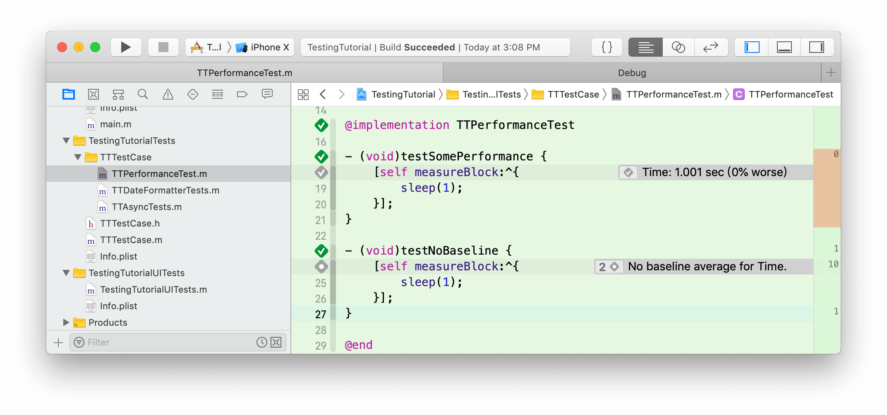

我们可以通过点击``measureBlock:``方法左边菱形圆心 icon ，来设置``Baseline``,设置之后需要点击``save``保存。之后再执行测试用例时，如果成功，左边的icon会从圆心变成一个 ✅。

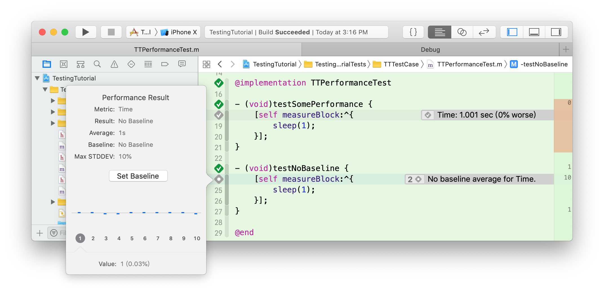


### 1.4 异步测试

什么时候需要使用异步测试：

* 打开文档 
* 在后台线程中执行的服务和网络活动
* 执行动画
* UI 测试时

#### 1.4.1 异步测试 XCTestExpectation

异步测试分为3个部分： **新建期望** 、 **等待期望被履行** 和 **履行期望** 。

* XCTestExpectation ：测试期望，可以由测试类持有，也可以自己持有，自己持有测试期望时灵活性更好一些，你可以选择等待哪些期望。

	```
	// 测试类持有的初始化方法
	XCTestExpectation *expect1 = [self expectationWithDescription:@"asyncTest1"];
	
	// 自己持有的初始化方法
	XCTestExpectation *expect2 = [[XCTestExpectation alloc] initWithDescription:@"asyncTest3"];
	```
	
* waitForExpectations:timeout: ：等待异步的期望代码执行，根据初始化方式不同，等待的方法不同。

	```
	// 测试类持有时的等待方法
	[self waitForExpectationsWithTimeout:10.0 handler:nil];
	
	// 自己持有时的等待方法
	[self waitForExpectations:@[expect3] timeout:10.0];
	```

* fulfill ：履行期望，并且适当加入``XCTAssertTrue``等断言，来验证测试结果。

	```
	XCTestExpectation *expect3 = [[XCTestExpectation alloc] initWithDescription:@"asyncTest3"];
    
    [TTFakeNetworkingInstance requestWithService:apiRecordList completionHandler:^(NSDictionary *response) {
        XCTAssertTrue([response[@"code"] isEqualToString:@"200"]);
        [expect3 fulfill];
    }];
    
    [self waitForExpectations:@[expect3] timeout:10.0];
	```

#### 1.4.2 异步测试 XCTWaiter

``XCTWaiter``是 2017 年新增的异步测试方案，可以通过代理方式来处理异常情况。

```
XCTWaiter *waiter = [[XCTWaiter alloc] initWithDelegate:self];
    
XCTestExpectation *expect4 = [[XCTestExpectation alloc] initWithDescription:@"asyncTest3"];
    
[TTFakeNetworkingInstance requestWithService:@"product.list" completionHandler:^(NSDictionary *response) {
	XCTAssertTrue([response[@"code"] isEqualToString:@"200"]);
	expect4 fulfill];
}];

XCTWaiterResult result = [waiter waitForExpectations:@[expect4] timeout:10 enforceOrder:NO];

XCTAssert(result == XCTWaiterResultCompleted, @"failure: %ld", result);
```

XCTWaiterDelegate：如果委托是``XCTestCase``实例，下方代理被调用时会报告为测试失败。
	

```
// 如果有期望超时，则调用。 
- (void)waiter:(XCTWaiter *)waiter didTimeoutWithUnfulfilledExpectations:(NSArray<XCTestExpectation *> *)unfulfilledExpectations;

// 当履行的期望被强制要求按顺序履行，但期望以错误的顺序被履行，则调用。
- (void)waiter:(XCTWaiter *)waiter fulfillmentDidViolateOrderingConstraintsForExpectation:(XCTestExpectation *)expectation requiredExpectation:(XCTestExpectation *)requiredExpectation;

// 当某个期望被标记为被倒置，则调用。 
- (void)waiter:(XCTWaiter *)waiter didFulfillInvertedExpectation:(XCTestExpectation *)expectation;

// 当 waiter 在 fullfill 和超时之前被打断，则调用。 
- (void)nestedWaiter:(XCTWaiter *)waiter wasInterruptedByTimedOutWaiter:(XCTWaiter *)outerWaiter;
```


### 1.5 查看测试结果

在执行测试用例后，Xcode 会返回给我们测试结果，可以通过一下途径查看：

* Test 导航栏
* Issue 导航栏
* 代码编辑器左边栏
* Report 导航栏

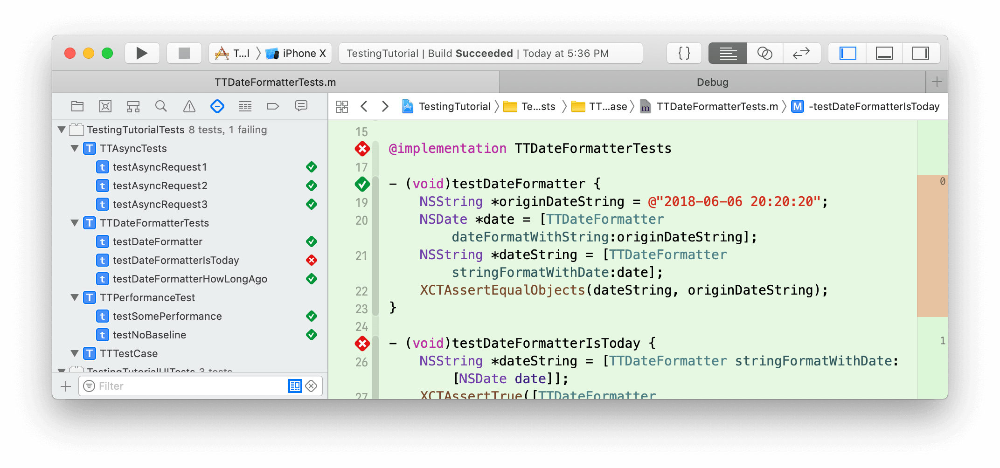

除此之外，我们还可以在 Report 导航栏中查看更加详细的测试报告:

- 测试通过/失败 
- 失败原因 
- 性能指标 
- 截屏
- 嵌套的 activities
- 测试覆盖率

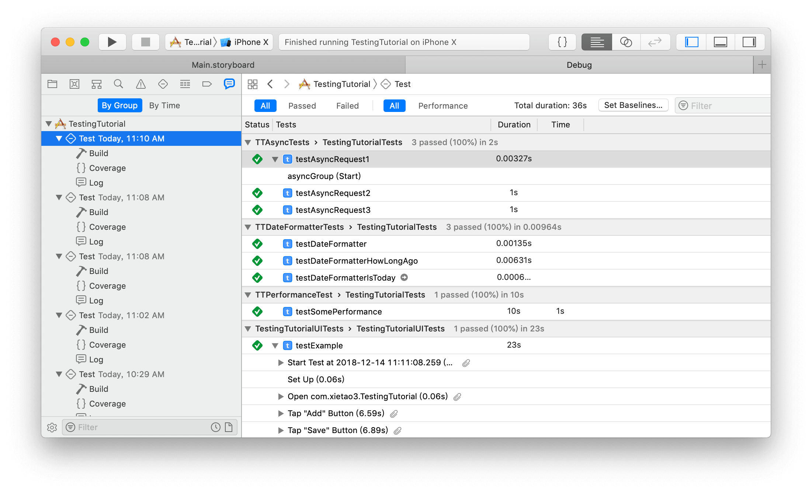

### 1.6 进行单元测试

我新建一个时间工具类，帮助我转换时间，在使用之前，我们需要先进行测试，以保证功能完整且正确。

这个工具类有以下 4 个公共方法，

```
@interface TTDateFormatter : NSDate

+ (NSString *)stringFormatWithDate:(NSDate *)date;

+ (NSDate *)dateFormatWithString:(NSString *)dateString;

+ (BOOL)isTodayWithDateString:(NSString *)dateString;

+ (NSString *)getHowLongAgoWithTimeStamp:(NSTimeInterval)timeStamp;

@end
```

针对一个工具类的测试我们可以新建一个``TTDateFormatterTests``测试类，继承一个测试基类。再根据不同的方法写不同的测试方法。如果有``if``和``switch``等条件语句导致逻辑分支的代码，尽量使各个逻辑分支都能测试到，可以配合代码覆盖率来检查哪些逻辑分支未测试。

```
@interface TTDateFormatterTests : TTTestCase
@end

@implementation TTDateFormatterTests

- (void)testDateFormatter {
    NSString *originDateString = @"2018-06-06 20:20:20";
    NSDate *date = [TTDateFormatter dateFormatWithString:originDateString];
    NSString *dateString = [TTDateFormatter stringFormatWithDate:date];
    XCTAssertEqualObjects(dateString, originDateString);
}

- (void)testDateFormatterIsToday {
    NSString *dateString = [TTDateFormatter stringFormatWithDate:[NSDate date]];
    XCTAssertTrue([TTDateFormatter isTodayWithDateString:dateString]);
    XCTAssertFalse([TTDateFormatter isTodayWithDateString:@"2000-01-01"]);
}

- (void)testDateFormatterHowLongAgo {
	// 该方法中包含一个 switch ，要保证 switch 每个逻辑分支都测试到，所以需要多个测试。
    NSDate *now = [NSDate date];
    NSString *secAgo = [TTDateFormatter getHowLongAgoWithTimeStamp:now.timeIntervalSince1970 - 10 * sec];
    XCTAssertEqualObjects(secAgo, @"10秒前");
    
    NSString *minAgo = [TTDateFormatter getHowLongAgoWithTimeStamp:now.timeIntervalSince1970 - 15 * min];
    XCTAssertEqualObjects(minAgo, @"15分钟前");
    
    NSString *hourAgo = [TTDateFormatter getHowLongAgoWithTimeStamp:now.timeIntervalSince1970 - 20 * hour];
    XCTAssertEqualObjects(hourAgo, @"20小时前");

    NSString *dayAgo = [TTDateFormatter getHowLongAgoWithTimeStamp:now.timeIntervalSince1970 - 25 * hour];
    XCTAssertEqualObjects(dayAgo, @"1天前");

    NSString *daysAgo = [TTDateFormatter getHowLongAgoWithTimeStamp:now.timeIntervalSince1970 - 50 * hour];
    XCTAssertEqualObjects(daysAgo, @"2天前");

    NSString *longTimeAgo = [TTDateFormatter getHowLongAgoWithTimeStamp:1544002463];
    XCTAssertEqualObjects(longTimeAgo, @"2018-12-05 17:34:23");
}
@end
```

合理使用测试基类和测试工具类，可以避免大量重复测试代码。时间转换工具类是一个没有外部依赖的类，当一些对外部有依赖的类需要测试时，可以尝试 [OCMock](https://github.com/erikdoe/ocmock) ，它能帮助你模拟数据。另外，当你觉得测试框架提供的断言方法无法满足你时，也可以试着使用 [OCHamcrest](https://github.com/hamcrest/OCHamcrest) 。

## 二、UI 测试

什么时候需要使用 UI 测试：

* 单元测试无法覆盖时的补充方案
* 单元测试更精准
* UI 测试覆盖面的更全

UI 测试的步骤：

* step1：与要测试或与逻辑有关的 UI 进行互动
* step2：验证 UIelements 属性和状态
    
    
### 2.1 UI Recording

通过 UI Recording ，可以将你操作手机的行为记录下来，并且转换成代码，可以帮助你快速生成 UI 测试代码。

选中 UI 测试类，你能再下方看到一个小红点，点击小红点开始录制你的交互。

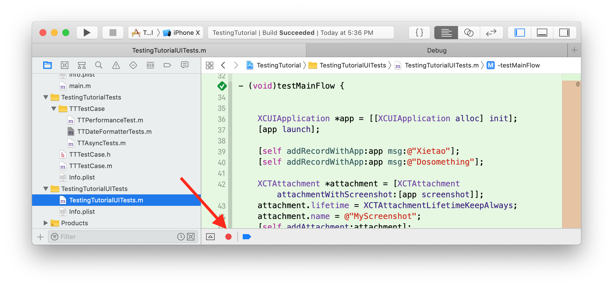

在你进行交互时，Xcode 会自动转化成代码，你可以借此创建新的测试代码，也可以以此拓展已经存在的测试代码。当然它也不是十分完美，并不是总能如你所愿，还需要你做一些处理，比如说自动生成的代码过于繁琐，你可以用一些更简洁的代码实现。即使这样，UI Recording 也是非常高效的方式。

     

### 2.2 UI 测试相关的类

#### 2.2.1 XCUIApplication

``XCUIApplication``可以返回一个应用程序实例，然后你就可以通过测试代码启动应用程序。

```
// 返回 UI 测试 Target 设置中选中的 Target Application 的实例
- (instancetype)init;

// 根据 bundleId 返回一个应用程序实例
- (instancetype)initWithBundleIdentifier:(NSString *)bundleIdentifier;

// 启动应用程序
- (void)launch;

// 将应用程序唤醒至前台，在多程序联合测试下会用到 
- (void)activate;

// 结束一个正在运行的应用程序
- (void)terminate;
```

#### 2.2.2 XCUIElement

应用程序中的 UI 控件，控件类型多样，可能是``Button``,``Cell``,``Window``等等。该类实例有很多模拟交互的方法，如``tap``模拟用户点击事件，``swipe``模拟滑动事件，``typeText:``模拟用户输入内容。

在 UI 测试中我们需要找到某个空间，可以通过他们的类型来缩小范围，比如当前页面有且只有一个``UITextView``控件，你可以通过以下代码来获取：

```
XCUIApplication *app = [[XCUIApplication alloc] init];
[app launch];

// 如果是 Cell 则对应 app.cells 
// firstMatch 返回第一个符合的控件
XCUIElement *textView = app.textViews.firstMatch;

// 模拟用户在 textView 输入内容
[textView typeText:@"input string"];
```

另外还有一种方式通过 Accessibility identifer， label， title 等等方式来定位对应的控件，如寻找一个名为 Add 的``button``。

```
// 需要勾选 Accessibility Enabled ，并且在 Label 一栏填入 Add
XCUIElement *addButton = app.buttons[@"add"];
// 模拟用户点击按钮
[addButton tap];
```


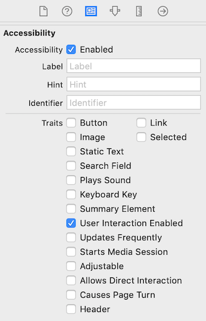

通过类型加 identifier 的方式来定位的控件元素的方式，可以满足大多数场景。


#### 2.2.3 XCUIElementQuery

``XCUIElementQuery``是一个用来定位控件元素的类，一般是一组符合筛选条件的元素集合。如``app.buttons``即返回 XCUIElementQuery 实例，是包含了当前所有的``button``的集合，你可以再通过 ``XCUIElementQuery``的方法做下一步的筛选。

XCUIElementQuery 常见定位元素的方法：

* count：匹配的数量;
	
	```
	// 当 navigationBars 的 count 等于 1 时，你可以直接定位到 navigationBar
	app.navigationBars.element 
	```
	
* subscripting：通过 id 来定位

	```
	table.staticTexts["Groceries"] 
	```

* index：通过元素的下标来定位

	```
	table.staticTexts.elementAtIndex(0) 
	```


定位元素除了利用元素类型、Accessibility Identifiers，Predicates 等筛选方法，还可以结合嵌套的层级关系来帮助定位。


### 2.3 进行 UI 测试

要进行 UI 测试需要以下几个步骤：

* step1：新建一个 UI 测试 Target。
* step2：使用 UI Recording 或手写代码，定位 UI 元素，并且模拟用户交互事件。
* step3：加入``XCTAssert``等断言逻辑，验证测试是否通过。

```
let app = XCUIApplication()
// 启动 app
app.launch()

// 定位元素
let addButton = app.buttons[“Add”]

// 模拟用户交互事件
addButton.tap()

// 验证测试是否通过
XCTTAssertionEqual(app.tables.cells.cout, 1)
```

大多数 UI 测试都是基于用户行为驱动，根据设计好的用户的操作流程，测试整个流程的结果。我设计了一个简单的笔记，主要有 3 步操作，分别是创建笔记、展示笔记和删除笔记，下面一起来看看如何进行测试。

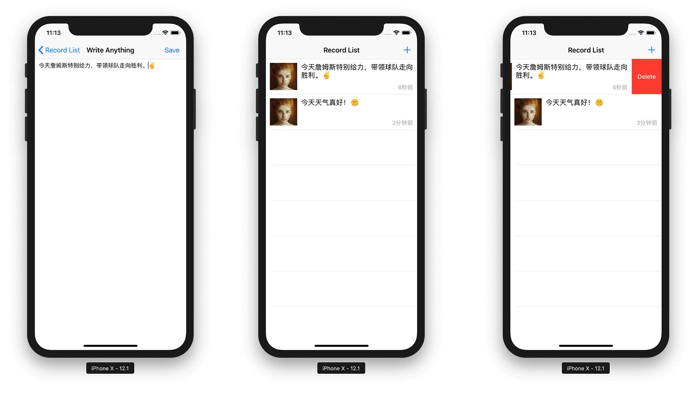

```
// 测试主流程
- (void)testMainFlow {
	// 启动 app
    XCUIApplication *app = [[XCUIApplication alloc] init];
    [app launch];
    
    // 添加笔记
    [self addRecordWithApp:app msg:@"今天天气真好！🌞"];
    [self addRecordWithApp:app msg:@"今天詹姆斯特别给力，带领球队走向胜利。✌️"];
	
    while (app.cells.count > 0) {
    	  // 删除笔记  
        [self deleteFirstRecordWithApp:app];
    }
}

/**
 添加笔记

 @param app app 实例
 @param msg 笔记内容
 */
- (void)addRecordWithApp:(XCUIApplication *)app msg:(NSString *)msg {
	// 暂存当前 cell 数量
    NSInteger cellsCount = app.cells.count;
    
    // 设置一个预期 判断 app.cells 的 count 属性会等于 cellsCount+1， 等待直至失败，如果符合则不再等待
    NSPredicate *predicate = [NSPredicate predicateWithFormat:@"count == %d",cellsCount+1];
    [self expectationForPredicate:predicate evaluatedWithObject:app.cells handler:nil];


	 // 定位导航栏+号按钮，点击进入添加笔记页面 
    XCUIElement *addButton = app.navigationBars[@"Record List"].buttons[@"Add"];
    [addButton tap];
    
    // 测试 未输入任何内容点击保存
    [app.navigationBars[@"Write Anything"].buttons[@"Save"] tap];
    
    // 定位文本输入框 输入内容
    XCUIElement *textView = app.textViews.firstMatch;
    [textView typeText:msg];
    
    // 保存
    [app.navigationBars[@"Write Anything"].buttons[@"Save"] tap];
        
    // 等待预期
    [self waitShortTimeForExpectations];
}

/**
 删除最近一个笔记

 @param app app 实例
 */
- (void)deleteFirstRecordWithApp:(XCUIApplication *)app {
    NSInteger cellsCount = app.cells.count;
    
    
    NSPredicate *predicate = [NSPredicate predicateWithFormat:@"count == %d",cellsCount-1];
    // 设置一个预期 判断 app.cells 的 count 属性会等于 cellsCount-1， 等待直至失败，如果符合则不再等待
    [self expectationForPredicate:predicate evaluatedWithObject:app.cells handler:nil];

	// 定位到 cell 元素
    XCUIElement *firstCell = app.cells.firstMatch;
    
    // 左滑出现删除按钮
    [firstCell swipeLeft];
    
    // 定位删除按钮
    XCUIElement *deleteButton = [app.buttons matchingIdentifier:@"Delete"].firstMatch;
    
    // 点击删除按钮
    if (deleteButton.exists) {
        [deleteButton tap];        
    }
    
    // 等待预期
    [self waitShortTimeForExpectations];

}
```

在上面的逻辑中涉及到异步的请求，我们可以通过利用``expectationForPredicate:evaluatedWithObject:handler:``方法监听``app.cells``的``count``属性，当满足``NSPredicate ``条件时，``expectation``相当于自动``fullfill``。如果一直不满足条件，会一直等待直至超时，除此之外还可以用通知和 KVO 的方式实现。

测试过程:

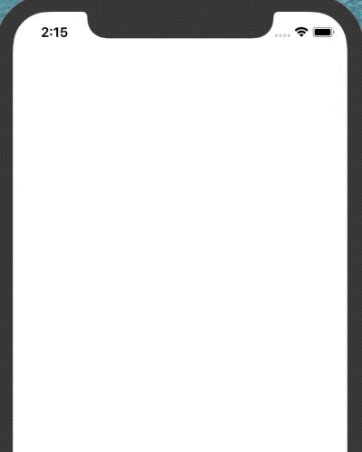


## 三、 拓展 Tips

### 3.1 多应用联合测试


多应用联合测试时，依赖``XCUIApplication``类的以下 2 个方法：

- initWithBundleIdentifier:
- activate

前者可以根据 BundleId 获取其他 App 的实例，让我们可以启动其他 App。后者可以让 App 从后台切换至前台，在多应用间切换。简单实现代码如下：


```
// 返回 UI 测试 Target 设置中选中的 Target Application 的实例
XCUIApplication *ttApp = [[XCUIApplication alloc] init];

// 使用 BundleId 获得另外一个 App 实例
XCUIApplication *anotherApp = [[XCUIApplication alloc] initWithBundleIdentifier:@"Another.App.BundleId"];

// 先启动我们的主 App
[ttApp launch];

// 做一系列测试

// 启动另一个 App
[anotherApp launch];

// 做一系列测试

// 回到我们的主 App (在 App 未启动的情况下调 activate 会让 App 启动)
[ttApp activate];
```

### 3.2 逻辑复杂场景下的 Activities 

在一些逻辑比较复杂的测试中，我们可以借助``XCTContext``类来帮我们把测试逻辑分割成多个小的测试模块。比如说我们有一个业务，关联多个模块，这个时候我们可以用类似下面的代码来处理：

```
// 模块 1
[XCTContext runActivityNamed:@"step1" block:^(id<XCTActivity>  _Nonnull activity) {
    XCTestExpectation *expect1 = [self expectationWithDescription:@"asyncTest1"];

    [TTFakeNetworkingInstance requestWithService:apiRecordSave completionHandler:^(NSDictionary *response) {
        XCTAssertTrue([response[@"code"] isEqualToString:@"200"]);
        [expect1 fulfill];
    }];
    
}];

// 模块 2
[XCTContext runActivityNamed:@"step2" block:^(id<XCTActivity>  _Nonnull activity) {
    XCTestExpectation *expect2 = [self expectationWithDescription:@"asyncTest2"];

    [TTFakeNetworkingInstance requestWithService:apiRecordDelete completionHandler:^(NSDictionary *response) {
        XCTAssertTrue([response[@"code"] isEqualToString:@"200"]);
        [expect2 fulfill];
    }];
    
}];

[self waitShortTimeForExpectations];
```

如果测试成功，可以在 Report 导航栏看到成功信息，它会按照你设置的模块分别展示测试结果。

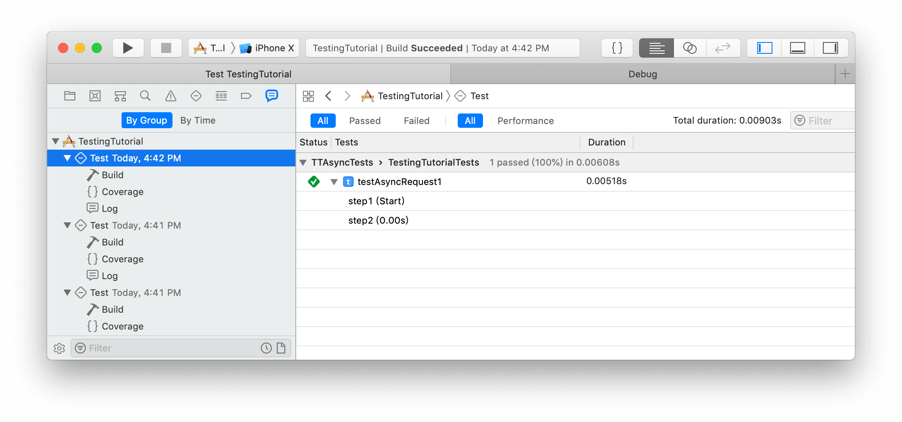

如果测试失败，你可以看到哪些模块是成功的，和在哪些模块中失败了。

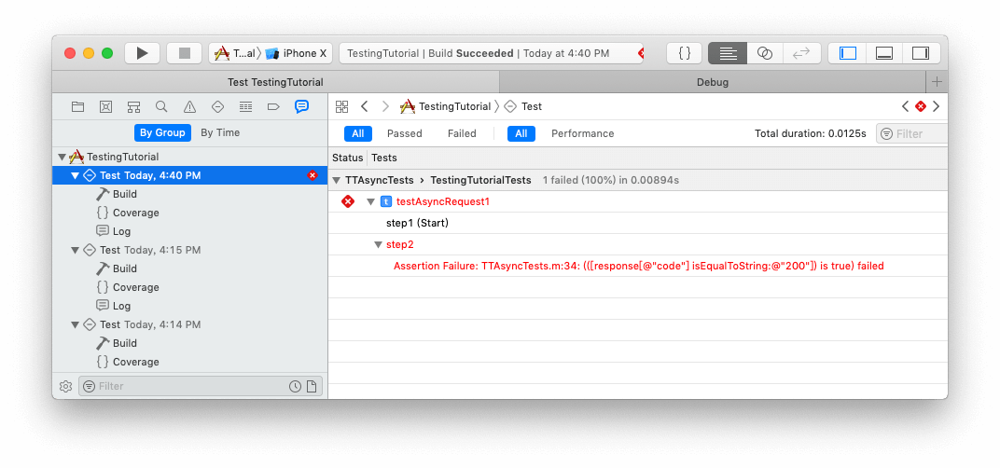

除此之外，你还可以尝试多层嵌套，activity 里面嵌套 activity。

### 3.3 截屏

在 UI 测试中有 2 种类型支持通过代码截屏，分别是``XCUIElement``和``XCUIScreen``。

```
// 获取一个截屏对象
XCUIScreenshot *screenshot = [app screenshot];

// 实例化一个附件对象 并传入截屏对象
XCTAttachment *attachment = [XCTAttachment attachmentWithScreenshot:screenshot];

// 附件的存储策略 如果选择 XCTAttachmentLifetimeDeleteOnSuccess 则测试成功的情况会被删除
attachment.lifetime = XCTAttachmentLifetimeKeepAlways;

// 设置一个名字 方便区分
attachment.name = @"MyScreenshot";

[self addAttachment:attachment];
```

在测试结束后，可以在 Report 导航栏中查看截图：

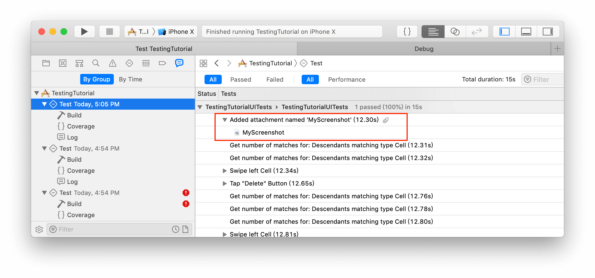

除此之外 Xcode 提供了自动截图的功能，可以帮助我们在每一个交互操作之后自动截图。此功能会产生大量截图，需要谨慎使用，一般情况最好勾选``Delete when each test succeeds``，需要在 Edit Scheme -> Test -> Options 中开启。

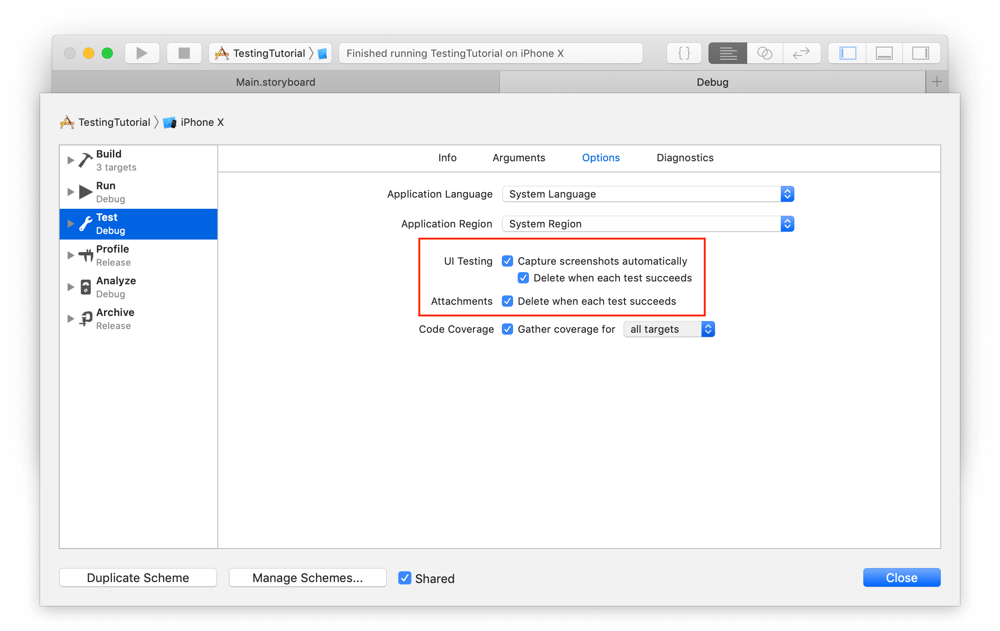

所以你可以根据你的需求选择适当的截图策略。

### 3.4 代码覆盖率

代码覆盖率在 Report 导航栏中查看，它除了可以帮你统计测试用例覆盖的代码百分比，还可以帮助你发现哪些代码是没有被测试用例覆盖的，需要在 Edit Scheme -> Test -> Options 中开启。

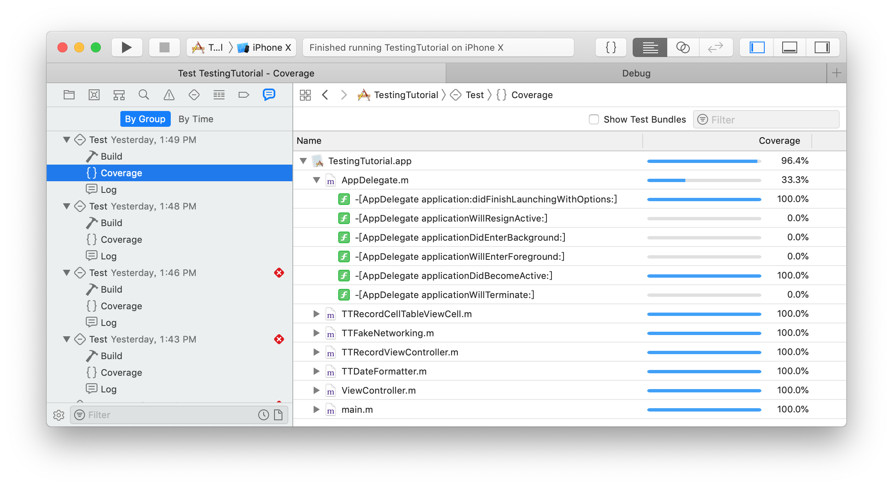


你还可以选择统计哪些 targets 的代码覆盖率，``all targets``表示统计项目内所有 targets 的覆盖率，``some targets``需要你手动添加 target ，只统计手动添加的 target 的覆盖率。


除了在 Report 导航栏中查看代码覆盖率的方式，你还可以借助苹果提供的命令行工具``xccov``来生成代码覆盖率报告。值得一提的是，``xccov``还能输出 JSON 格式的报告。

### 3.5 跳过部分测试

在 Xcode 10 中新增功能，在 Edit Scheme -> Test -> Info -> Tests 中可以通过取消勾选，来选择跳过部分测试用例。在 target 的 Options 选项中，``Automatically includes new tests``，选项是默认勾选的，新建的测试文件会自动添加进去。
 
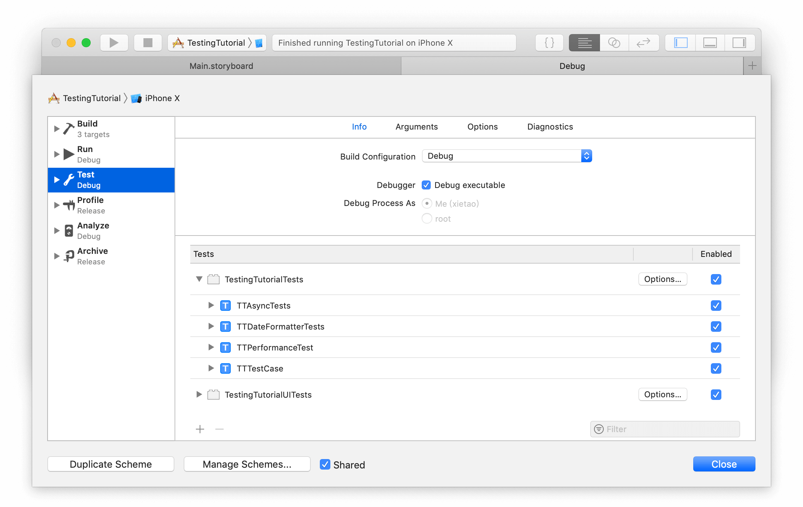


### 3.6 测试用例的执行顺序

默认情况下，测试用例执行的顺序是按字母顺序来执行的，按固定顺序执行可能会使一些隐式的依赖关系无法被发现。现在有了随机的执行顺序，就可以挖掘出那些隐式的依赖关系。可以在 Edit Scheme -> Test -> Info -> Tests -> Options 中开启该功能。

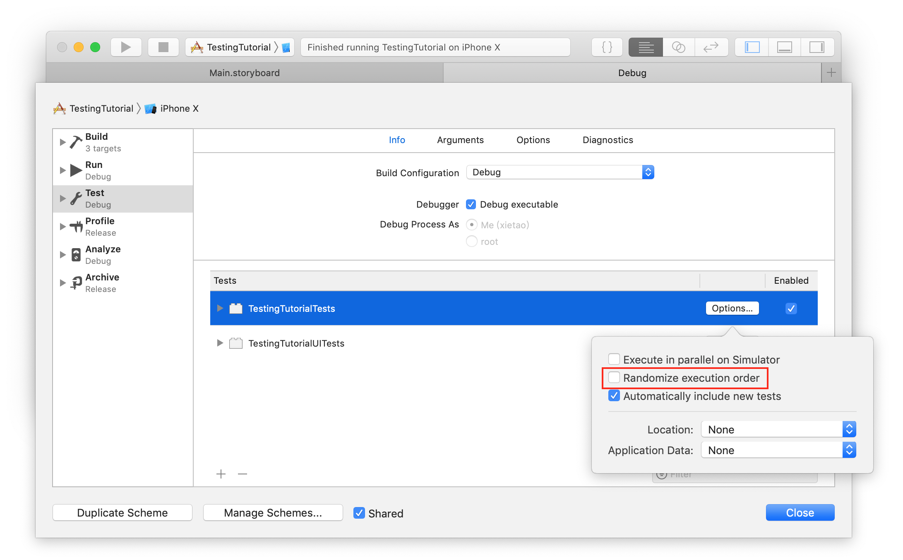

            
### 3.7 并行测试

并行测试可以同时进行多个测试，从而节省大量时间。在测试时会启动多个模拟器，模拟器之间的数据都是隔离的，可以在 Edit Scheme -> Test -> Info -> Tests -> Options 中开启该功能。

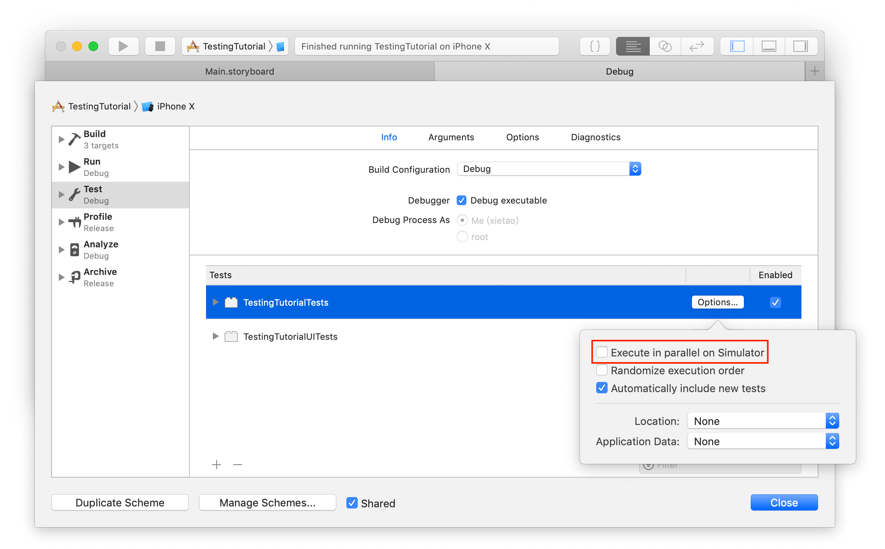

对于并行测试的一些建议：

* 某个测试用例需要消耗大量时间的类，可以拆分成多个类并行测试，从而节省时间。
* 你需要清楚哪些测试在并行执行时是不安全的，避免并行执行这些测试。
* 性能测试的可以统一放在一个 Bundle 中，禁用并行执行。
         

## 四、工程可测性

单元测试的结构：

1. 准备输入
2. 运行需要测试的代码
3. 验证输出

可测试代码的特征：

* 避免过多输入
* 输出是可见的
* 没有隐藏的状态

### 4.1 可测性 Tips

* 参数化：减少共享单例的引用，测试的方法需要接受参数输入和明确的输出。
* 分离逻辑和结果：抽离逻辑，最终测试代码尽量精简。
* 平衡单元测试和 UI 测试：单元测试适合测试用户交互行为无法覆盖的代码，和小而完整的代码。UI 测试更适合测试大范围的功能集合。

### 4.2 帮助 UI 测试更加完善

* 用精巧聪明的代码缩减 UI 测试的代码量
* 将复杂的查询逻辑进行封装
* 对常见组合操作的 UI 测试流程进行封装
* 避免逻辑混乱和冗余

                          
#### 4.3 合理使用快捷键

* 避免使用 macOS 的菜单栏
* 使逻辑上下紧密，避免逻辑分离
 
### 4.3 测试代码的质量

* 写测试代码之前多构思很重要
* 测试代码应该支撑你的 App 的拓展
* 业务代码中的编码原则也适用于测试代码

本节内容根据 [WWDC 2017 Session 414：Engineering for Testability](https://developer.apple.com/videos/play/wwdc2017/414/) 粗略总结得出，如果需要了解更多相关内容可以查看相关视频。
            
## 总结

掌握这些测试相关 API 并不难，但是好的代码需要经过完整项目的磨砺和时间的考验。同时也可以借鉴一些开源项目的测试代码，尝试着爬上巨人的肩膀。

## 参考

[WWDC 2018 Session 403：What's New in Testing](https://developer.apple.com/videos/play/wwdc2018/403/)

[WWDC 2017 Session 414：Engineering for Testability](https://developer.apple.com/videos/play/wwdc2017/414/)

[WWDC 2017 Session 409：What's New in Testing](https://developer.apple.com/videos/play/wwdc2017/409/)

[WWDC 2015 Session 406：UI Testing in Xcode](https://developer.apple.com/videos/play/wwdc2015/406/)

[WWDC 2014 Session 414：Testing in Xcode 6](https://developer.apple.com/videos/play/wwdc2014/414/)
